# Proyecto final -  Tecnología de la programación
# Sistema de registro y evaluación de estudiantes

## Descripción del problema
Sistema donde se pueden registrar alumnos, con seis calificaciones cada uno, para luego poder promediar sus calificaciones y en base a ese promedio verificar si el estudiante esta aprobado o reprobado, mostrar a los alumnos con mejor y con peor promedio respectivamente y calcular el promedio general del grupo, asi como mostrar un reporte con el promedio grupal y el promedio de cada alumno.

Este sistema esta pensado para mejorar y agilizar los procesos de calificación de los estudiantes en instituciones académicas y esta diseñado para que pueda ser usado por los docentes y por la parte administrativa de dichas instituciones

## Pseudocódigo
```
INICIO

    // =====================================
    //         MÓDULO DE VALIDACIÓN
    // =====================================

    FUNCIÓN ValidarCalificación(calificación)
        SI
            calificación >= 0 Y calificación <= 10
            RETORNAR verdadero
        Sino
            RETORNAR falso
        FIN SI
    FIN FUNCIÓN

    FUNCIÓN ValidarNombreUnico(nombres, nombre)
        SI
            nombre NO ESTA EN nombres
            RETORNAR verdadero
        SINO
            RETORNAR falso
        FIN SI
    FIN FUNCIÓN

    // =====================================
    //         MÓDULO DE CÁLCULO
    // =====================================

    FUNCIÓN CalcularPromedo(calificaciones)
        Suma = 0
        PARA CADA calificación EN calificaciones HACER
            suma = suma + calificación
        FIN PARA
        RETORNAR suma/Cantidad(califiaciones)
    FIN FUNCIÓN

    FUNCIÓN DeterminarEstado(promedio)
        SI promedio >= 6
            RETORNAR "Aprobado"
        SINO
            RETORNAR "Reprobado"
        FIN SI
    FIN FUNCIÓN 

    FUNCIÓN EncontrarMejor(estudiantes)
        mejor = estudiantes[0]
        PARA CADA estudiante EN estudiantes HACER
            SI estudiante.promediio > mejor.promedio 
                mejor = estudiante
            FIN SI
        FIN PARA
        RETORNAR mejor
    FIN FUNCIÓN 

    FUNCIÓN EncontrarPeor(estudiantes)
        peor = estudiantes[0]
        PARA CADA estudiante EN estudiantes HACER
            SI estudiante.promedio < peor.promedio ENTONCES
                peor = estudiante
            FIN SI
        FIN PARA
        RETORNAR peor
    FIN FUNCIÓN 

    FUNCIÓN CalcularPromedioGrupal(estudiantes)
        suma = 0
        PARA CADA estudiante EN estudiantes HACER
            suma = estudiante.promedio
        FIN PARA
        RETORNAR suma/Cantidad(estudiantes)
    FIN FUNCIÓN

    // =====================================
    //         MÓDULO DE DATOS
    // =====================================

    FUNCIÓN CrearEstudiante(nombre, calificaciones, promedio, estado)
        estudiante.nombre = nombre
        estudiante.calificaciones = calificaciones
        estudiante.promedio = promedio
        estudiante.estado = estado

        RETORNAR estudiante
    FIN FUNCIÓN

    // =====================================
    //         MÓDULO DE DATOS
    // =====================================

    FUNCIÓN MostrarEstudiante(estudiante)
        MOSTRAR "Nombre: " + estudiante.nombre

        MOSTRAR "Calificaciones: " 
        PARA CADA calificación EN calificaciones HACER
            MOSTRAR calificación
        FIN PARA
    
        MOSTRAR "Promedio: " + estudiante.promedio
        MOSTRAR "Estado: " + estudiante.estado
    FIN FUNCIÓN 

    FUNCIÓN GenerarReporte(estudiantes)
        MOSTRAR "Reporte del grupo"
        PARA CADA estudiante EN estudiantes HACER
            MostrarEstudiante(estudiante)   
        FIN PARA

        mejor = EncontrarMejor(estudiantes)
        peor = EncontrarPeor(estudiantes)

        promedioGrupal = CalcularPromedioGrupal(estudiantes)

        MOSTRAR "Estadisticas: "
        MOSTRAR "Promedio del grupo: " + promedioGrupal
        MOSTRAR "Mejor promedio: " + mejor.nombre + "," + mejor.promedio
        MOSTRAR "Peor promedio: " + peor.nombre + "," + peor.promedio
    FIN FUNCIÓN

    // =====================================
    //         PROGRAMA PRINCIPAL
    // =====================================

    estudiantes = Lista vacía
    nombresRegistrados = Conjunto vacío
    continuar = "s"

    MIENTRAS continuar = "s" HACER
        MOSTRAR "REGISTRO DE ESTUDIANTE"
        nombre = ""

        REPETIR
            MOSTRAR "Ingrese el nombre del estudiante"
            LEER nombre
            SI NO ValidarNombreUnico(nombresRegistrados, nombre) ENTONCES
                ESCRIBIR "Error: Este nombre ya ha sido registrado"
            FIN SI
        HASTA QUE ValidarNombreUnico(nombresRegistrados, nombre)

        calificaciones = Lista vacia

        PARA i = 1 hasta 6 HACER
            REPETIR
                MOSTAR "Ingrese la calificación " + i + ": "
                LEER calificación

                SI NO ValidarCalificacion(calificación) ENTONCES
                    MOSTRAR "Error: Ingrese una calificación valida entre el 0 y 10"
                FIN SI
            HASTA QUE ValidarCalificaciones(calificación)
        
            AGREGAR calificación A calificaciones
        FIN PARA

        promedio = CalcularPromedio(calificaciones)
        estado = DeterminarEstado(promedio)

        estudiante = CrearEstudiante(nombre, calificaciones, promedio, estado)
        AGREGAR estudiante A estudiantes
        AGREGAR nombre A nombresRegistrados
        MOSTRAR "¿Desea agregar otro estudiante? (s/n)?
        LEER continuar 
    FIN MIENTRAS

    SI cantidad(estudiantes) > 0 ENTONCES
        GenerarReporte(estudiantes)
    SINO
        mostrar "No se han registrado estudiantes?
    FIN SI
FIN
```

## Diagramas de flujo
### MAIN
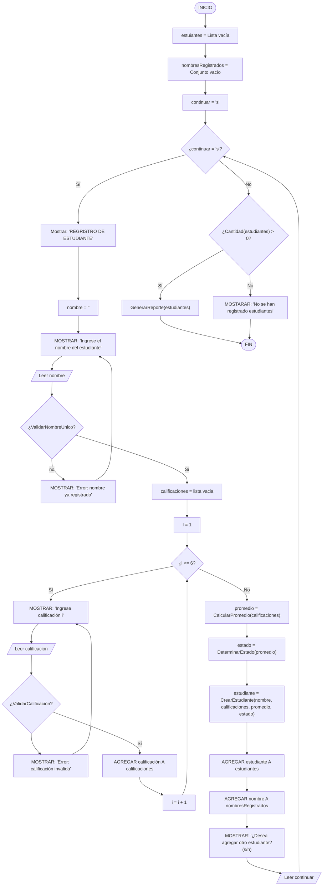
---

### ValidarCalificación
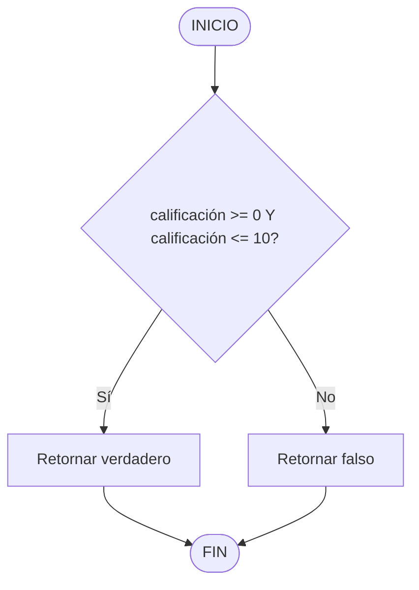
---

### ValidarNombreUnico
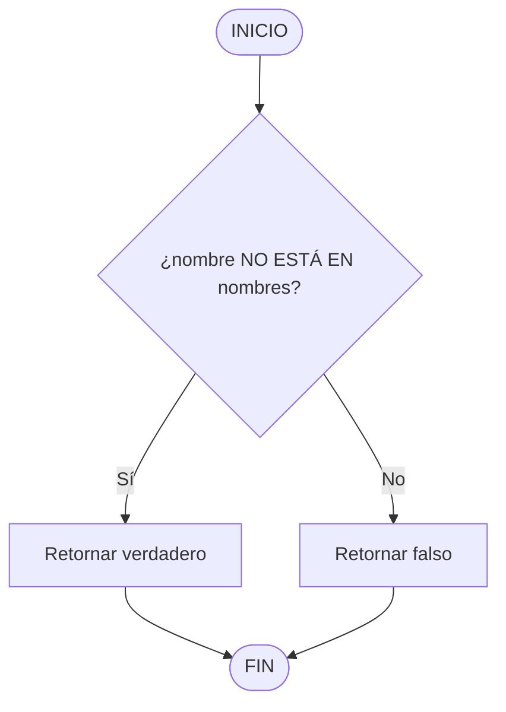
---

### CalcularPromedio
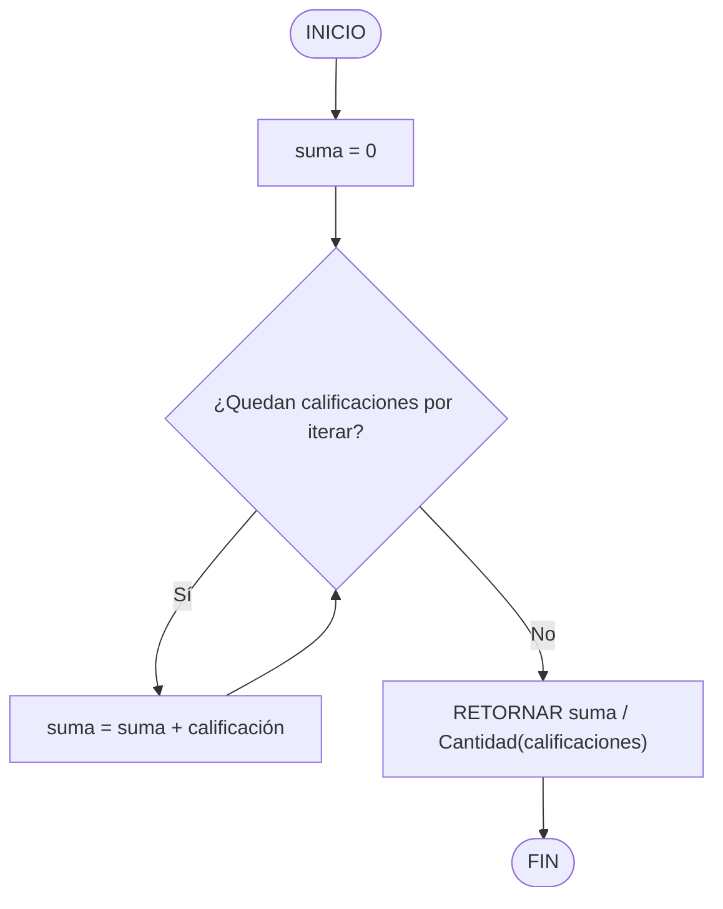
---

### DeterminarEstado
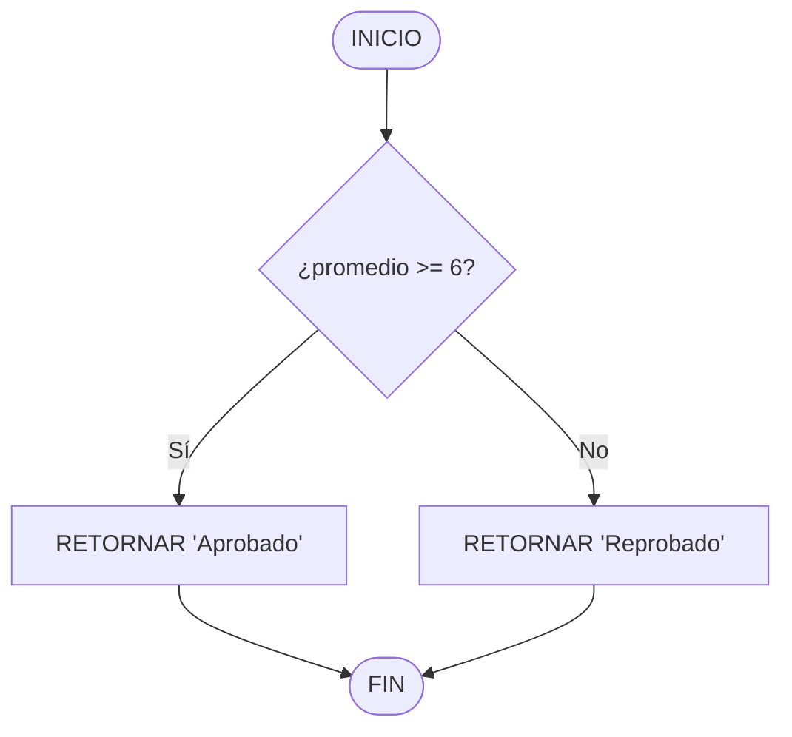
---

### EncontrarMejor
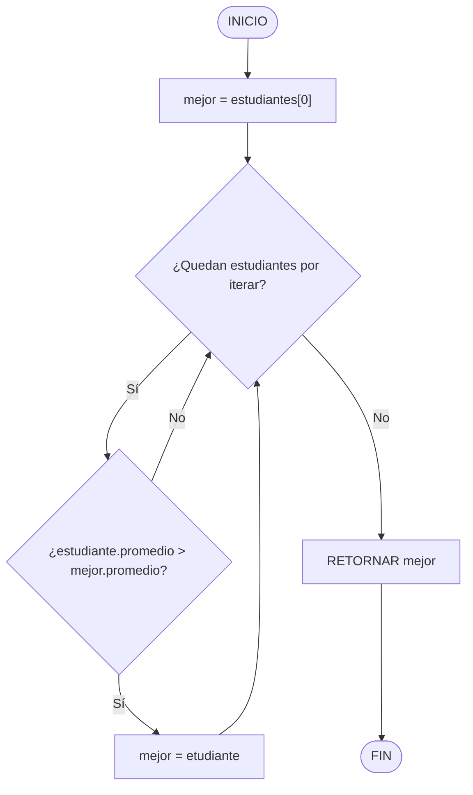
---

### EncontrarPeor
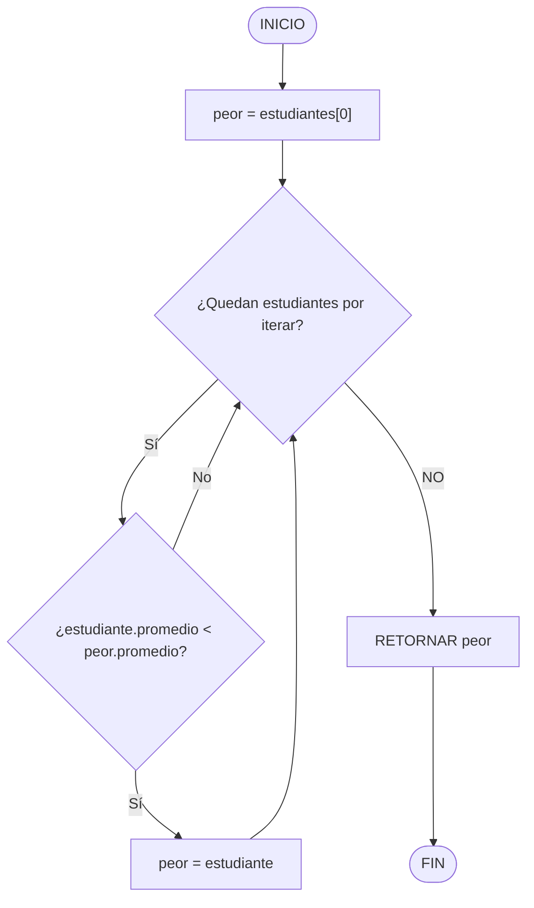
---

### CalcularPromedioGrupal
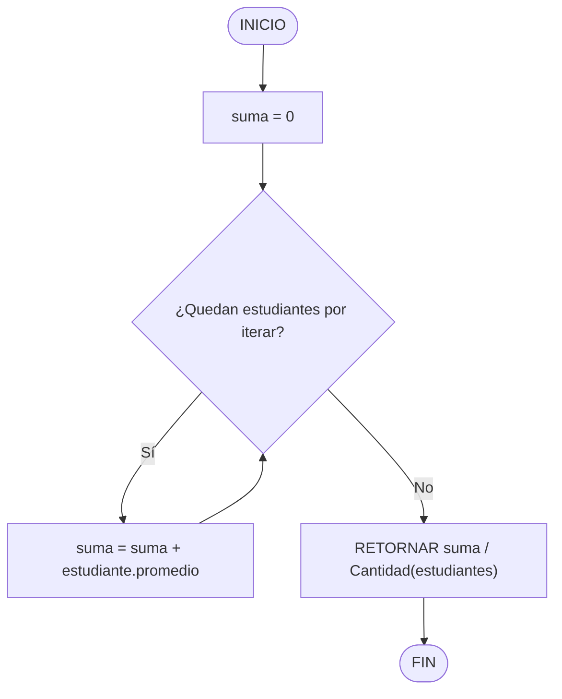
---

### CrearEstudiante
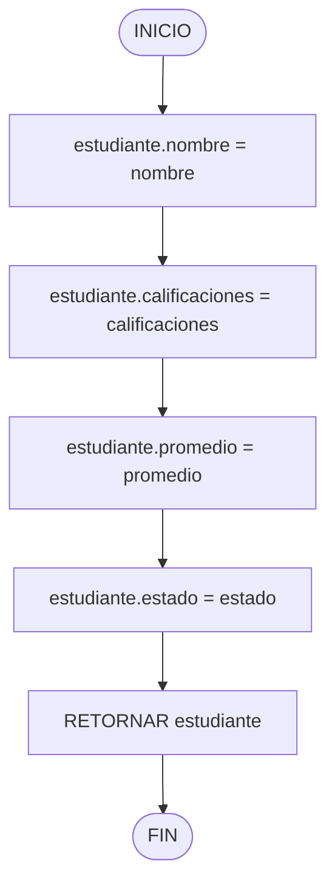
---

### MostrarEstudiante
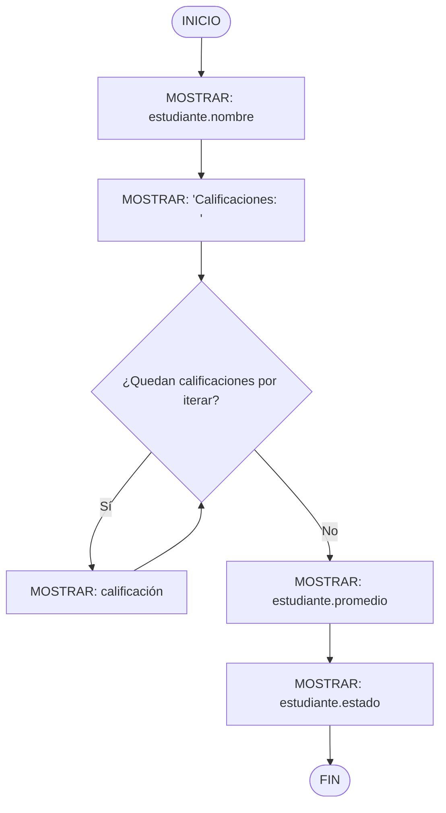
---
### GenerarReporte
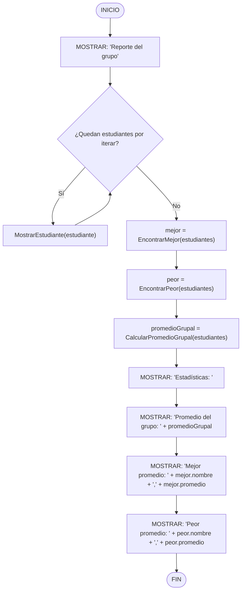